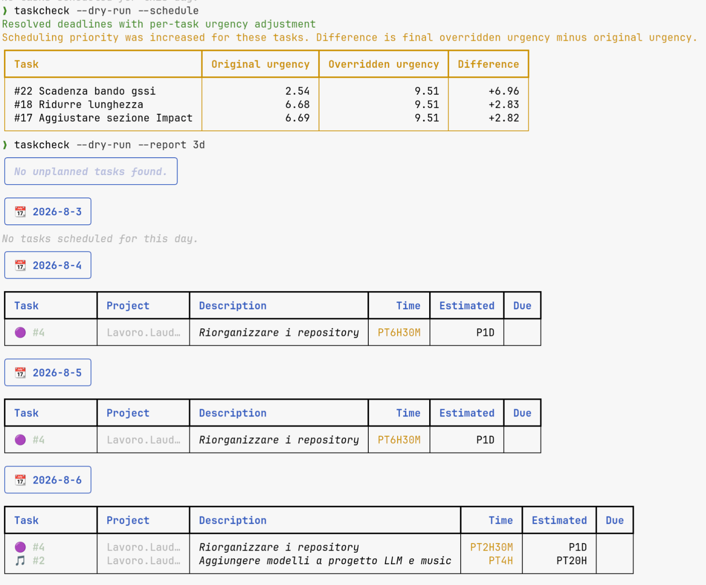
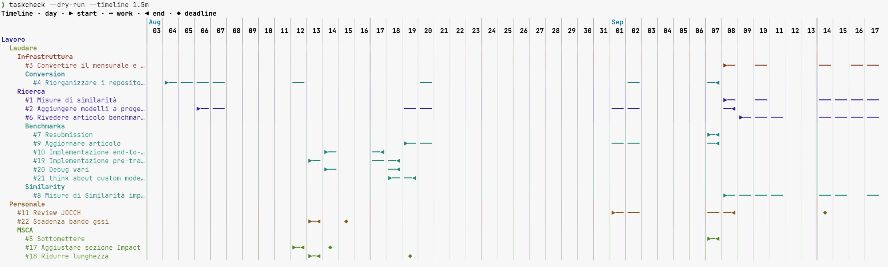

A Taskwarrior scheduler for people who want a realistic plan, not a manual to-do list.
It turns tasks, working hours, and calendar blocks into an actionable schedule — then keeps due dates visible.

Use it if you want to:
- stop guessing what to do next
- fit tasks into real availability
- be sure your long-time plan won't go overdue
- keep Taskwarrior as the source of truth





> [!IMPORTANT]
> This repo is actively maintained again

## Features

- ✨ Auto-schedule tasks from working hours + calendar blocks
- 🧭 Support complex working-hour maps
- ⏱️ Consider urgency, due dates, and dependencies
- 🧪 Persisted dry-run previews for reports and timelines
- ↩️ Undo the latest schedule update
- 🧠 Auto-adjust urgency when deadlines cannot be met
- 🔄 Force-refresh iCal calendars
- 📊 Custom reports for planned and unplanned tasks
- 🗓️ Project-grouped timelines with day, week, and month views
- 🎨 Report styling with emoji and extra attributes
- 🗓️ Block time with iCal or Google Calendar, including all-day events

## Quick start

1. `pipx install taskcheck`
2. `taskcheck --install` ← setup only
3. add `estimated` + `time_map` UDAs
4. edit `~/.config/task/taskcheck.toml` (see [Reference](#Reference))
5. `taskcheck --schedule`
6. `taskcheck --undo` restores the scheduling fields changed by the latest run

## How it works

Taskcheck reads your pending and waiting tasks, estimates when each one can be worked on, and writes back a schedule.
It respects:
- your working hours
- task duration estimates
- calendar events and vacations from iCal / Google Calendar
- task urgency and due dates

It updates Taskwarrior with:
- `scheduled` → when work should start
- `completion_date` → when work is expected to finish
- a warning when a task will miss its due date

### Required UDAs

- `estimated`: expected duration in hours
- `time_map`: which working-hour profile applies to the task, for example `work` or `weekend`

Example:

```toml
[time_maps.work]
monday = [[9, 12.30], [14, 17]]
tuesday = [[9, 12.30], [14, 17]]
```

### Reports and timelines

- `taskcheck -r today` → tasks planned for today
- `taskcheck -r 1w` → tasks planned for the next week
- `taskcheck --timeline 1w` → automatic day/week/month timeline for the next week
- `taskcheck --timeline eom --zoom week` → weekly timeline through month end

Create a preview with `taskcheck --schedule --dry-run`. It does not update Taskwarrior; instead, it saves the generated schedule to the Taskwarrior data directory. Reuse it with `taskcheck --report today --dry-run` or `taskcheck --timeline 1w --dry-run`.

Timeline rows follow dotted project levels such as `work.client`. Without `--zoom`, the most detailed view that fits the terminal width is selected: day, then week, then month. The track uses `▶` for a start, `━` for work, `◀` for an end, and `◆` for a deadline. Thin, heavy, and double rules separate days, weeks, and months. Project colors are deterministic and adapt to light or dark terminals through OSC 11, with config and environment fallbacks.

## Reference

📚 Full reference: [REFERENCE.md](REFERENCE.md)

In short:
- `taskcheck --install` is interactive
- it installs required Taskwarrior settings if you confirm the first prompt
- it installs optional urgency/report tuning if you confirm the second prompt
- it can also create the default config file if you confirm the third prompt
- scheduling happens with `taskcheck --schedule`
- all flags/config keys/settings are documented in `REFERENCE.md`

## They say it's an AI

The algorithm simulates a workday one chunk at a time.

For each day starting from today, it sorts tasks by urgency and picks the most urgent task that fits the available time.
It assigns a small block of work, then recomputes urgency exactly as Taskwarrior would on that day.
If urgency changes, the next task choice can change too.

For `today`, taskcheck skips past hours.

The default work chunk is 2 hours (or less if the task is shorter); you can tune it with the Taskwarrior UDA `min_block`.

Before writing a schedule, taskcheck backs up the affected tasks' `scheduled`, `completion_date`, and `scheduling` fields under the Taskwarrior data directory. `taskcheck --undo` restores and consumes the newest backup. The `[scheduler]` option `n_undos` controls retention and defaults to `1`; set it to `0` to disable backups.

If a task would finish after its due date, taskcheck retries with a total-urgency override. Each retry moves the task immediately above the task with the smallest greater urgency by adding `urgency_epsilon` (default: `0.1`). At rank 1, it adds epsilon for up to `max_top_urgency_rounds` retries (default: `10`), then tries once at urgency `1000`. If the task is still late, taskcheck stops raising it and optimizes the other overdue tasks.

## Tips and Tricks

- You can exclude a task from being scheduled by removing the `time_map` or `estimated` attributes.
- You can see tasks that you can execute now with the `task ready` report.

See the reference section above for flags, config keys, and installed Taskwarrior settings.
